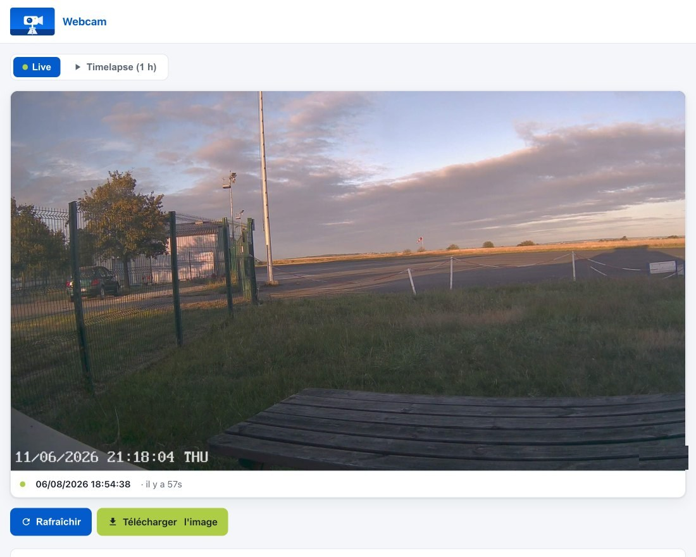
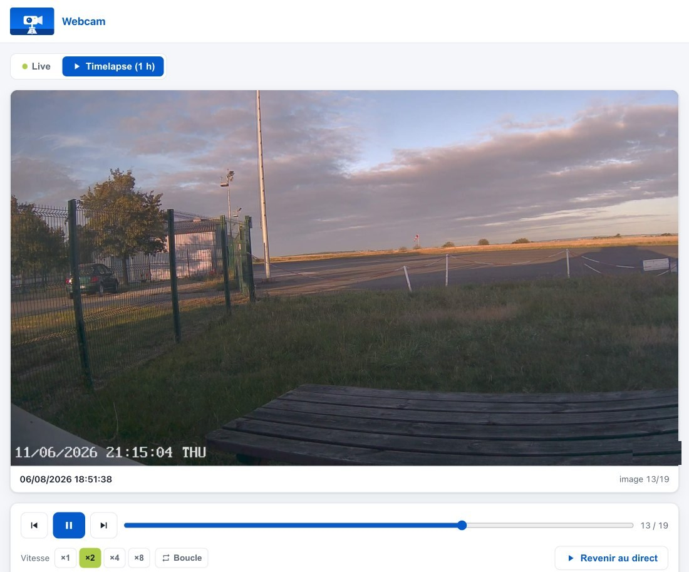

# Webcam

Page web pour une caméra qui pousse ses photos par FTP : image en direct et
timelapse de la dernière heure, rejouable. Conçue pour un aéroclub — la
page publique d'un terrain d'aviation — mais rien n'est spécifique à
l'aéronautique.



**PHP 8, zéro dépendance, zéro build.** Pas de Composer, pas de npm, pas de
base de données, pas de cron : on dépose les fichiers sur un hébergement
mutualisé et ça tourne.

## Ce que ça fait

- **Live** — la dernière image, rafraîchie automatiquement, avec un bandeau
  d'alerte si la caméra se tait.
- **Timelapse** — rejeu de la dernière heure, lecture/pause, vitesses ×1 à
  ×8, navigation image par image, curseur.
- **URL stable** (`latest.jpg`) — toujours la dernière image, à donner à une
  appli tierce ou un écran d'affichage.
- **Ménage automatique** — les images au-delà de la rétention sont
  supprimées à la volée, sans cron.



## Prérequis

- **PHP 8.0+**. L'outil facultatif `tools/generate-assets.php` (régénération
  des images placeholder) demande PHP 8.1+ et l'extension GD ; il le vérifie
  au lancement.
- **Apache** avec `mod_rewrite` et `AllowOverride All` — le `.htaccess`
  fourni porte l'essentiel de la sécurité, et `mod_rewrite` en est la pièce
  maîtresse : c'est lui qui interdit d'exécuter un PHP déposé dans `snap/`.
  Sans lui, l'app renvoie délibérément 500 sur tout plutôt que de s'ouvrir.
  `mod_headers` est recommandé mais facultatif : son absence ne coûte que
  les en-têtes de cache.
- **Une caméra** capable de pousser des snapshots en FTP avec un nom de
  fichier horodaté (voir ci-dessous). Testé avec une Reolink ; toute caméra
  respectant le format convient.

## Installation

```bash
# 1. Déposer les fichiers dans le dossier servi par Apache
#    (ex. /webcam/ ou la racine du domaine)

# 2. Créer sa configuration
cp config.example.php config.php

# 3. Créer le dossier des images. Il doit être inscriptible par le compte
#    FTP de la caméra (dépôt) ET par le serveur web (ménage : pas de cron,
#    c'est PHP qui supprime). Même compte pour les deux sur la plupart des
#    mutualisés ; sinon voir doc/DEPLOIEMENT.md §1.
mkdir snap && chmod 755 snap
```

Puis éditer **`config.php`** — au minimum `CAM_PREFIX`, `SITE_TITLE` et
`SITE_BASE_URL` — et **`.htaccess`** : ajuster `RewriteBase` **et les deux
`ErrorDocument`** au chemin d'installation (`/webcam/` ou `/`). Ces trois
lignes sont marquées « ⚠️ À ADAPTER » dans le fichier. Oublier les
`ErrorDocument` ne casse pas la page, mais chaque requête refusée renvoie
alors une erreur Apache sur l'erreur.

Sans `config.php`, l'app démarre sur `config.example.php` : pratique pour
essayer, mais la configuration ne survivra pas à une mise à jour.

## Format des noms de fichiers — le point critique

C'est le contrat entre la caméra et l'application, et **la première cause
d'échec au déploiement**. L'heure affichée vient du **nom du fichier**,
jamais de sa date système (faussée par l'upload FTP).

```
snap/AAAA/MM/JJ/<CAM_PREFIX>_<canal>_AAAAMMJJhhmmss.jpg

exemple :  snap/2026/06/11/cam_01_20260611193004.jpg
                           └─┘ └┘ └────────────┘
                       préfixe canal  horodatage
```

Un fichier qui ne correspond pas est **ignoré en silence**. Si la page reste
vide alors que les images arrivent bien, c'est ici qu'il faut regarder.

Côté caméra, il faut donc configurer : l'envoi FTP vers le dossier `snap/`,
la création automatique des sous-dossiers `AAAA/MM/JJ`, et un nom de fichier
préfixé horodaté. Sur les Reolink, ces trois réglages sont dans
*Paramètres → Surveillance → FTP*.

## Configuration

Tout est dans [`config.example.php`](config.example.php), documenté ligne à
ligne. Les réglages les plus utiles :

| Constante | Défaut | Rôle |
|---|---|---|
| `CAM_PREFIX` | `cam` | Préfixe des fichiers poussés par la caméra |
| `SITE_TITLE` | `Webcam` | Titre de la page et de l'onglet |
| `SITE_BASE_URL` | *(vide)* | URL publique, pour l'aperçu de lien. Vide = pas de balises Open Graph |
| `WINDOW_SECONDS` | `3600` | Durée rejouable en timelapse |
| `RETENTION_SECONDS` | `3600` | Durée de conservation des images |
| `MAX_IMAGES` | `600` | Borne anti-abus sur la liste JSON |
| `CORS_ALLOWED_ORIGINS` | `[]` | Origines autorisées à lire `images.php` et `latest.jpg` en `fetch()` |

**Fenêtre et rétention** sont indépendantes, mais on ne peut pas rejouer ce
qui a été supprimé : pour un timelapse de 2 h, passer les **deux** à `7200`.
Si la rétention est plus courte que la fenêtre, l'app borne automatiquement
et affiche la durée réellement disponible.

## Endpoints

| URL | Réponse |
|---|---|
| `/` | La page |
| `/latest.jpg` | Dernière image (JPEG). URL stable pour applis tierces |
| `/images.php` | Liste JSON de la fenêtre courante + déclenche le ménage |

Les `url` du JSON sont **relatives à la racine de l'app** : un consommateur
d'une autre origine les préfixe lui-même. Afficher l'image dans une balise
`` ne demande aucun réglage CORS ; seul un accès en `fetch()`/XHR
nécessite d'inscrire l'origine dans `CORS_ALLOWED_ORIGINS`.

Contrats détaillés dans [doc/TECHNIQUE.md](doc/TECHNIQUE.md).

## Sécurité

Le dossier `snap/` est alimenté par FTP : c'est une **zone d'écriture
partiellement hors de votre contrôle**. Le `.htaccess` fourni empêche
l'exécution de tout code qui y serait déposé.

Sous `snap/`, seul un chemin conforme au contrat de nommage est servi —
filtrage sur le chemin complet, pas sur le seul suffixe `.jpg`, faute de quoi
un `evil.php.jpg` s'exécuterait sur les hébergeurs qui mappent PHP sur toute
extension `.php` présente dans le nom.

⚠️ **Ne pas réordonner les règles rewrite** du `.htaccess`, et ne pas ajouter
de point d'entrée PHP sans l'inscrire dans la liste blanche. Les règles sont
commentées ; le raisonnement complet est dans
[doc/SECURITE.md](doc/SECURITE.md).

Le `.htaccess` étant ignoré par `php -S`, ces protections ne se vérifient
qu'en production : dérouler la checklist de
[doc/DEPLOIEMENT.md](doc/DEPLOIEMENT.md) après la mise en ligne.

Pour signaler une vulnérabilité : [SECURITY.md](SECURITY.md).

## Développement

```bash
php -S 127.0.0.1:8000        # serveur de dev
php -l lib.php               # lint (pas de tests automatisés)
```

En dev, utiliser `latest.php` — la réécriture vers `latest.jpg` est assurée
par Apache, que `php -S` n'utilise pas.

Pour disposer d'images de test, déposer quelques JPEG dans
`snap/AAAA/MM/JJ/` en respectant le format de nom, avec des horodatages
dans la fenêtre courante.

## Personnalisation visuelle

Les images livrées (logo, favicon, icône iOS, aperçu de lien) sont des
**placeholders neutres**. Remplacez-les par les vôtres en conservant les
noms et les dimensions :

| Fichier | Dimensions |
|---|---|
| `logo.png` | 480×300 (affiché à 44 px de haut) |
| `favicon.png` | 32×32 |
| `apple-touch-icon.png` | 180×180 |
| `og-image.jpg` | 1200×630 |

`php tools/generate-assets.php .` régénère les placeholders. Les couleurs
suivent `THEME_COLOR` et `THEME_ACCENT` de la configuration.

## Licence

[AGPL-3.0](LICENSE). Si vous déployez une version modifiée accessible en
ligne, vous devez en publier le code source.

Les images placeholder sont couvertes par cette licence. **Les logos et
marques que vous y substituez ne le sont pas** — ils restent votre
propriété, ou celle de leur titulaire.
